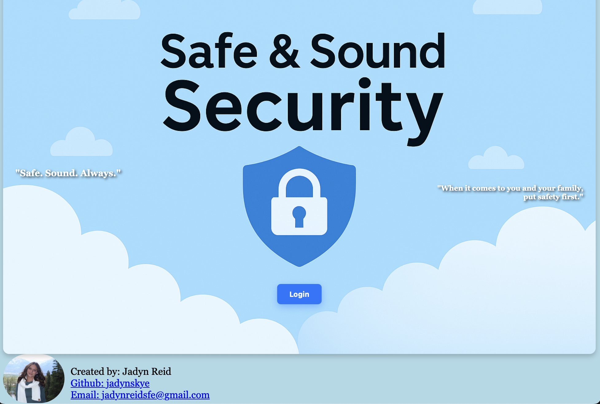
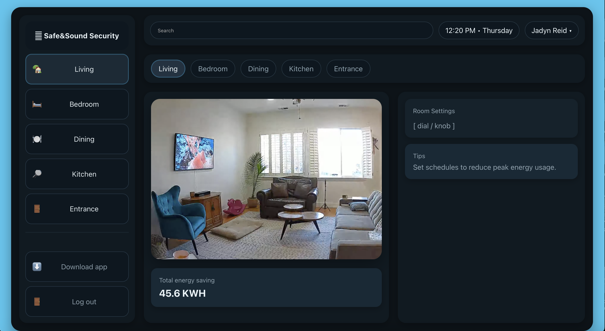

# ☁️ Safe&Sound Security

This is my first project working on frontend engineering with HTML and CSS, and I’m super stoked to say I love it!
I’ve put many hours into this project, and seeing it come to life has been an awesome journey.

Safe & Sound Security is a full-stack inspired project that simulates a smart home security dashboard.
Right now it includes a login page that leads to a responsive dashboard UI.

📊 Features

	• Login page (navigates to dashboard)
	• Dashboard layout with space for status cards, controls, and notifications
	• Responsive design (works on desktop & mobile)
	• Clean and modern UI
    • Device controls (lock/unlock doors, arm/disarm system, turn lights on/off)
	• Simulated camera feed (placeholder images that update in real time)
	• Notification panel with live updates (new events appear at runtime)
	• JavaScript interactions (real-time toggles, mock “WebSocket-style” events)
	• Reusable styles (grid layouts, card components, buttons, and status dots)
	• Scalable project structure (HTML pages, shared CSS, JS logic, and assets folder)
 
🔑 Login Page

 

🏠 Home Page

Some back end portions of the project are still in the works but happy to share what this project looks like so far!

 

📂 Project Structure

    SafeAndSound/
    │── index.html        # Dashboard page
    │── login.html        # Login page
    │── styles.css        # Main styling
    │── images/           # Logos, background images, etc.
    │── README.md         # Project description

🛠️ Tech Stack

	•	HTML5 – page structure
	•	CSS3 – styling and responsiveness
