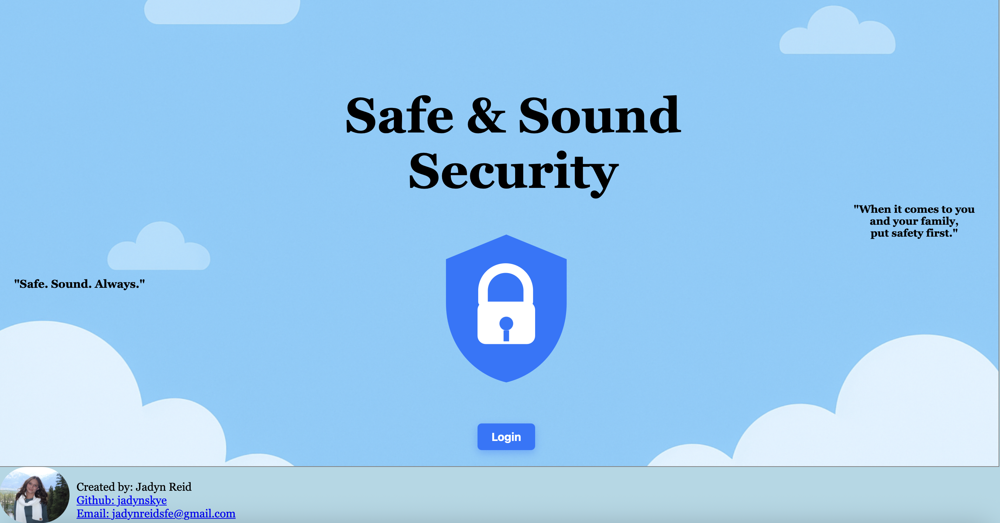
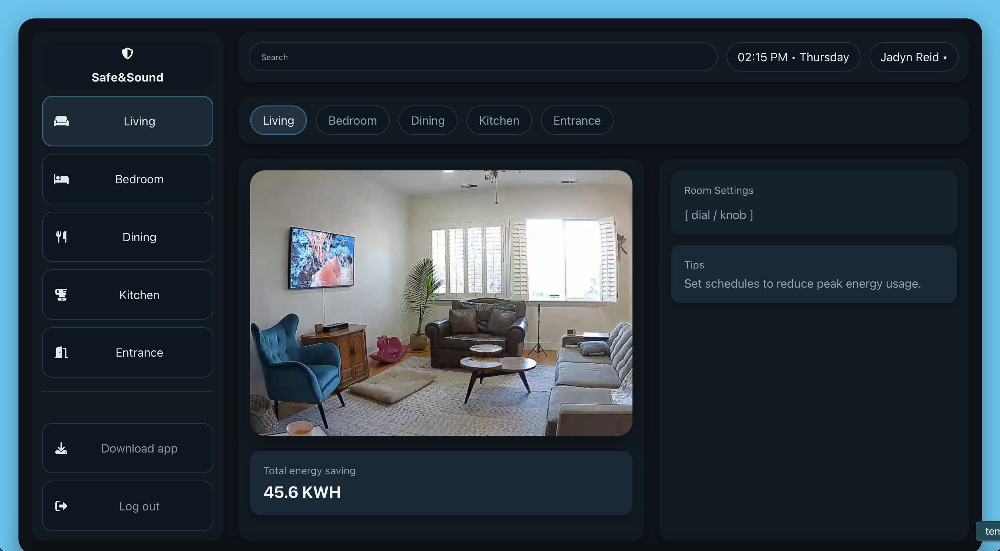
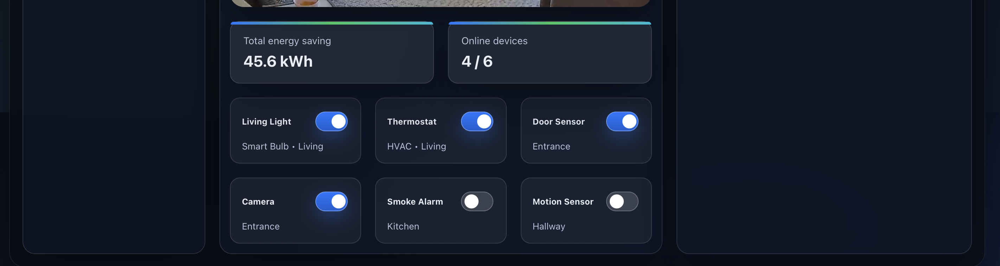
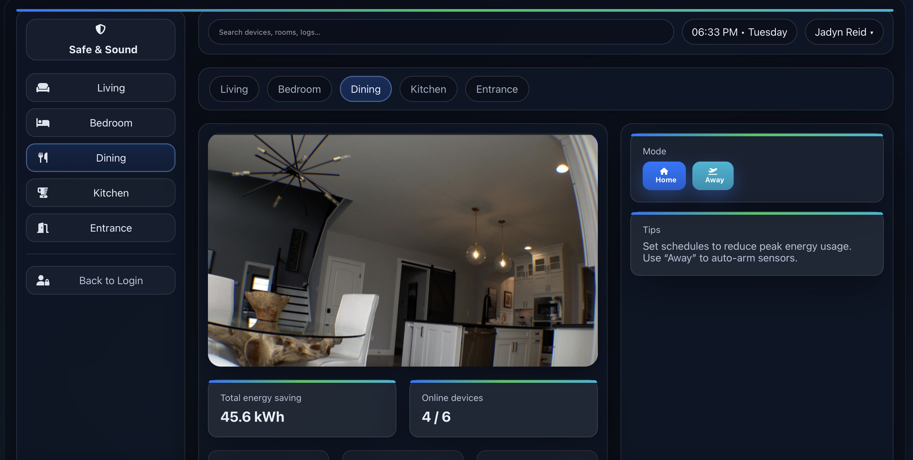

# ☁️ Safe&Sound Security

This is my first full-stack inspired project, and I’m stoked to say I loved building it!  
I started with HTML and CSS for the frontend, then connected it to a backend with FastAPI and SQLite.  
Seeing it all come to life as a working login + dashboard has been such a cool journey. I will definitely come back and try to grow this project more by adding scheduling for devices, user authentication with real tokens, push notifications, and even real camera feeds as I learn more.

Safe & Sound Security is a smart home dashboard demo where you can log in and control devices.  
It has a clean UI, device toggles, and even live updates over WebSockets.

---

## 📊 Features

- **Login page** → connects to the FastAPI backend and takes you to the dashboard  
- **Dashboard layout** → sections for devices, metrics, and camera feeds  
- **Responsive design** → works on both desktop and mobile  
- **Device controls** → toggle devices (lights, sensors, thermostat, etc)  
- **Simulated camera feed** → placeholder images that switch by room  
- **Real-time updates** → WebSocket keeps device states in sync  
- **Reusable styles** → grid layouts, cards, buttons, and status blocks  
- **Backend API** → FastAPI endpoints for login and devices, plus SQLite database with demo data  

---

## 🔑 Login Page

---

## 🏠 Dashboard Page

Backend + frontend come together here. Devices are pulled from the API, toggles change their state,  
and WebSockets update everything live.

Showcasing device toggles:  

Showcasing multi-camera view:  

---

## 📂 Project Structure

SafeAndSound/  
│── backend/  
│   ├── app.py        # FastAPI app (routes, WebSocket, seeding demo data)  
│   ├── db.py         # SQLite setup (engine + session)  
│   ├── models.py     # User, Device, Schedule tables  
│── scripts/  
│   ├── login.js      # Handles login form and API call  
│   ├── dashboard.js  # Handles toggles, tabs, WebSocket live updates  
│── s&s-login.html    # Login page  
│── s&s-login.css     # Login CSS  
│── dashboard.html    # Dashboard page  
│── dashboard.css     # Dashboard CSS  
│── images/           # Logos, screenshots, placeholders  (not included in repo but some images are shown)
│── README.md         # Project description  

---

## 🛠️ Tech Stack

- **Frontend** → HTML5, CSS3, JavaScript  
- **Backend** → Python, FastAPI  
- **Database** → SQLite
- **Realtime** → WebSocket (FastAPI + JS client)  
